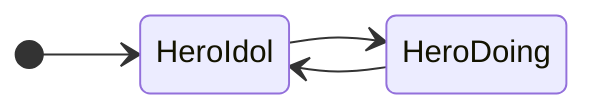

# RoguelikeTDD

[](https://github.com/nowsprinting/RoguelikeTDD/actions/workflows/metacheck.yml)
[](https://github.com/nowsprinting/RoguelikeTDD/actions/workflows/test.yml)
[](https://github.com/nowsprinting/RoguelikeTDD/actions/workflows/deploy.yml)


## このリポジトリについて

このリポジトリは、同人誌『GitHub CopilotとのペアプロTDDでつくるローグライクRPG』のサンプルコードです。

ゲームの最新ビルドは [https://nowsprinting.github.io/RoguelikeTDD/](https://nowsprinting.github.io/RoguelikeTDD/) でプレイできます。


## 注意事項

- TextMesh Pro Essentialsをトラッキングから外しているので、最初に再生するときにインポートを促すウィンドウが出ます。それに従ってインストールしてください
- プロダクトコードは、Copilotからの提案をできるだけ残しています（あえてリファクタリングしていません）
- タグ `chapXX` は、各章終了時点のコミットを指しています


## ゲームプレイ

### キーボード

- **HJKLYUBN**キー：移動


## 設計資料

### プロジェクトの構造

```
Assets
└── RoguelikeTDD
    ├── Resources
    │   ├── Fonts           フォントアトラスを格納
    │   └── Sprites         スプライト画像を格納
    ├── Scenes
    │   └── Dungeon.unity   インゲームのSceneファイル
    ├── Scripts
    │   ├── Editor
    │   └── Runtime         プロダクトコード（ゲーム本体側のコード）
    │       ├── Dungeon     主に第4章「ダンジョンの自動生成」のプロダクトコード
    │       └── Hero        主に第5章「プレイヤーキャラクター」のプロダクトコード
    └── Tests
        ├── Editor
        └── Runtime         テストコード
            ├── Dungeon     主に第4章「ダンジョンの自動生成」のテストコード
            ├── Hero        主に第5章「プレイヤーキャラクター」のテストコード
            ├── TestDoubles テストダブル
            └── TestUtils   テストに使用する補助的なクラスなど
```


### 状態遷移図




## 権利表記・ライセンス

Copyright (c) 2023 Koji Hasegawa

MIT License


### サードパーティ ライセンス

<dl>
  <dt><a href="https://itouhiro.hatenablog.com/entry/20130602/font">PixelMplus</a></dt>
  <dd>Copyright (C) 2002-2013 M+ FONTS PROJECT<br/>
    M+ FONT LICENSE</dd>
  <dt><a href="https://gist.github.com/kgsi/ed2f1c5696a2211c1fd1e1e198c96ee4">kgsi/japanese_full.txt</a></dt>
  <dd>ライセンス未表記</dd>
</dl>
